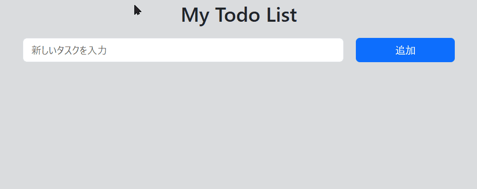

# simple-todo-list

## 概要  
このプロジェクトは、HTML・CSS・JavaScript を使って作成したシンプルなToDoリストアプリです。
タスクの追加、削除、完了チェックなどの基本機能を実装しています。JavaScriptの学習を目的として制作しました。

## デモ

## 使用技術  
- HTML  
- CSS（Bootstrap 5 利用）  
- JavaScript

## 主な機能  
- タスクの追加  
- タスクの削除  
- タスクの編集
- タスクの完了チェック